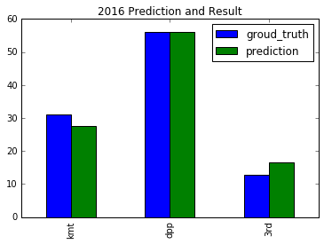
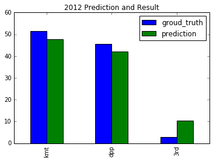
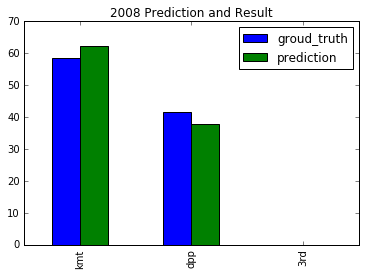
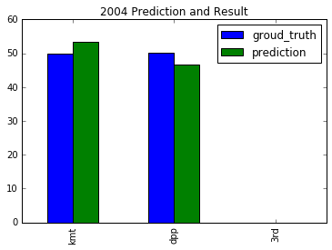
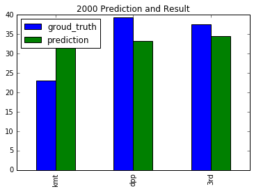
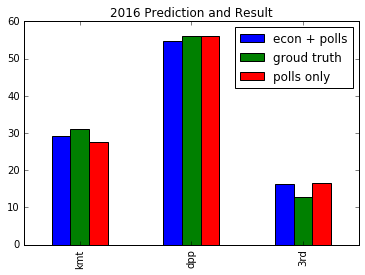
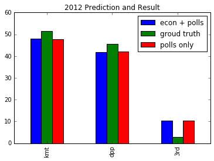
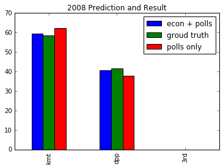
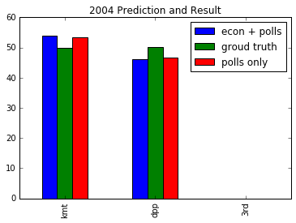
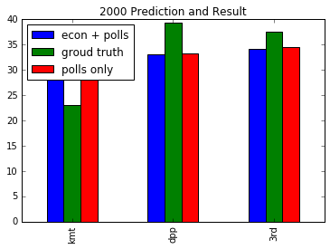

# A Prediction Model for Taiwan Presidential Election

[Github](https://github.com/mw10104587/tw_president_prediction)
[iPython Notebook](https://github.com/mw10104587/tw_president_prediction/blob/master/Predicting%20with%20pollsters.ipynb)
[Files](https://drive.google.com/open?id=16YvVVK06X0pWsRJCijeAaThY8zymqVYToewzpxXoGpA)

## Introduction
Taiwan has held 6 general presidential elections since the start of direct election in 1996 (The 85th year of the Republic Era). Like USA, Taiwan is also a two-party system country. However, unlike Democrats and Republicans, are divided based on beliefs like liberal or conservative, right-leaning or left-leaning, Taiwan's `Kuomintang` (KMT) and `Democratic Progressive Party` (DPP) are divided mostly based on how close they want to be with China. If you are for KMT, it probably means that you're expecting a China-leaning policy and most trading would be done with China, and you might even expect one day Taiwan become a province of China. If you are for DPP, it probably means that you believe trading with other countries in the world work as well, and you tend to be slightly more liberal and you hope that Republic of China one day becomes Taiwan and truely independent one day. There are several researches that focus on the ideology of Taiwan citizens and the trend of whether Taiwanese prefers to become independent, however, this is something really hard to measure, and the data are scarce. It would be a great indicator for a prediction model if we have a handful of data. Here, I will be trying to do the most basic prediction model, using a collection of pollster data to make another prediction and the result is later tweaked based on some economic indices.


## Data
#### Pollings
[Data and its source](https://docs.google.com/spreadsheets/d/1VPkx73XGLPaxwcWmxUJgB6FP7sMPU-PQk8z6LWpVJlo/edit?usp=sharing)

#### Economic Indices for all parties
[Aggregated data](https://docs.google.com/spreadsheets/d/1ncJyLGb9Zdxxq0zFAg9dbn7LuhXjjYgeN6B_CpMwDGE/edit?usp=sharing)

One thing to notice here, because the presidential elections are held in the first quarter of its year. Specifically, some of them in January and others in March. To capture the economic environments people experience before they make their votes, I think it makes more sense to use data of previous year's last month/quarter. So if you read a data in the spreadsheet under the column 2016, it means that the value of this index is selected from 2015 December.

1. Gross Domestic Product - [Macro Stats Database](http://statdb.dgbas.gov.tw/pxweb/Dialog/statfile9L.asp)
GDP is the most popular and the most representative index for a country's economy, it is a common practice to pick this as an indicator. According to the practice of media in Taiwan, they usually tell people what the GDP is instead of the change of GDP, therefore, I decided to use the value of GDP instead of the annual change.

2. Unemployment Rate - [Directorate-General of Budget, Accounting and Statistics](http://statdb.dgbas.gov.tw/pxweb/Dialog/NI.asp)
Besides GDP, unemployment rate is another key index that people see often in Taiwan's TV and newspaper. 

3. [Stock(Current Data)](http://www.luckstar.com.tw/Taiex/FTaiex.aspx)
3.5 [Stock(Not Enough, not used)](http://www.tse.com.tw/ch/trading/indices/MI_5MINS_HIST/MI_5MINS_HIST.php) 
For Stock data, I choosed to use the delta of stock market. The value is 
```[(last day price of the year before election) - (last day price of two years before the election)]/(last day price of two years before the election)```
For example if the election is held in 1996, then the parameters would be `p2 = price of Dec.31 in 1995` and `p1 = price of Dec.31 on 1994`. The value that we're using would be `(p2-p1)/p1`. The reason that I pick that is because most of the elections are held in January. Meaning the data of that year doesn't really work as an indicator, we should use the year before the year the election was held instead. The reason that I picked the delta of the stock market is because Taiwan's stock market is relatively young, if we use the absolute value, it wouldn't make much sense since 

4. [Consumer Price Index](http://www.stat.gov.tw/np.asp?ctNode=485)
In Taiwan, we use Consumer Price Index as a measure of inflation. Inflation are pretty sensitive towards the people since they have to spend much more money on their everyday groceries. I think this is a good indicator for people making political decision.

5. [Disposable Income](http://statdb.dgbas.gov.tw/pxweb/Dialog/NI.asp) The amount of disposblae money that each household have.

#### Considered Economic Indices but not included
- Amount of Mainlaind China tourist: 
This is a tricky data. Tourist from Mainland China has always been one of the signature policy that the Nationalist try to sell it's voters. They claim that to sustain business for all kinds of tourist related business, it is very important that KMT stay in power since they have a better relation with Mainland China. 
However, on China's side, they think that it would have a bad effect on its people if they travel to Taiwan during the campaign period. Unlike other indices, I use the sum of the whole year(for last two years) and use the delta between the last president. If the amount is positive, it is a good sign for the KMT.
Before 2008, people from Mainland China can't come to Taiwan due to it's policy, the number drastically increased after 2008. After considering that this value would be very unfair for elections before 2008, I removed it from the list.


## Model
- Pollings weighted on pollster quality and date from election day 
- Economic Indices


## What I've done
1. Understand Monte Carlo (and found that **it doesn't fit in my final project since most of our polling are of national scale**)
2. Collect Data
I spend most of my time collecting data from all over the place.
For recent polling data(2 years), netizens aggregated part of them on Wiki, and I also found data for 2000 and 2004 in a [book](https://books.google.com/books?id=pJUmE33ZmHcC&lpg=PA187&dq=2004%E5%B9%B4%E4%BB%A3%E6%B0%91%E8%AA%BF&source=bl&ots=U1m0L45Jfe&sig=j8iCGyOsnq3zz0NABounL8DTldg&hl=en&sa=X&output=reader&pg=GBS.PA168#v=onepage&q=2004年代民調&f=false). For polling data in 2000, the book marked that due to a serious event called "中興票券事件", which the child of the most promising candidate (Soong Chu-yu) at that time was reported being involved in a financial scandal, the polling changed drastically. Originally, Soong was the leader in all pollings. After the news burst out, his polling fell and **all** the polling results changed. Somehow meaning that the pollings before that event wasn't that informative.
There are literally no polling data that I can find for the first direct election in 1996 when former president Lee Teng-hui was elected. This was the first presidential election that people can participate in the history. There are some articles that mentioned the polling before that election, but no polling companies name are mentioned.
3. Clean data
- Renaming fuzzy names:
This process includes (1) Polls completed by campaign teams, I recoginize the as a pollster done by the party. (2) Pollings are still listed as the pollster company instead of the media even if the media is the main sponsor for that polling.
There's one thing specifically interesting here. "China Times" used to be a media with high reputation with a lot of famous writers and reporters. Tsai Eng-meng, a businessman who is pro-China, bought it in 2009 and renamed it "Wong Wong China Times". Therefore there are "旺旺中時" and "中國時報" two different kind of pollsters because most people and I believe that they are not the same media(pollster) anymore.
- Format the dates
- Remove all "%" character from the data and add it to header instead.

4. Rank each pollsters based on past performance using simple mean error and the amounts of polling it did
There is one pollster(砝迪斯) that claimed to do pollings by using **big data**. They did a polling of sample size 24200(hilariously big), but being questioned about the methodology details, they can't give a clear answer. I banned this pollster due to its unethical mean to help a particular candidate.
5. Make predictions by weighting on the quality of pollsters (mean error and polling numbers) and the number of days before the election that pollster was completed.
```
w = sqrt(polling count/mean error)/(days from election)
```
6. Select and collect the economic indices that I would like to use. The data is [here](https://docs.google.com/spreadsheets/d/1ncJyLGb9Zdxxq0zFAg9dbn7LuhXjjYgeN6B_CpMwDGE/edit?usp=sharing)
7. [Standardize all the indices](https://docs.google.com/spreadsheets/d/1ncJyLGb9Zdxxq0zFAg9dbn7LuhXjjYgeN6B_CpMwDGE/edit?usp=sharing) and calculate a CA_MODEL value for each year based on the selected indices by summing them up. If the result is 


## Result with polls only prediction
#### 2016 Prediction

My prediction model estimated the winner DPP with a pretty close guess of only a margin of 0.00427%. Without considering economic indices, the model underestimated the votes for 3.4% of KMT votes and overestimated 3.8% votes for the third party.

#### 2012 Prediction


#### 2008 Prediction

For 2008 and 2012, [Ma Ying Jeou](https://en.wikipedia.org/wiki/Ma_Ying-jeou) represents KMT to run for the president and won both of them with a pretty large margin. Due to his positive image and a series of negative news about the previous DPP president, people had been expecting a new party to run the government for a long while. 

#### 2004 Prediction

This year is another tricky case. On [2004 March 19](https://en.wikipedia.org/wiki/3-19_shooting_incident), the day before the election, the incumbent president Chen Shui-bian of the Democratic Progressive Party was also on the street soliciting votes. A gunman came and shot two bullets toward the president and VP. It caused a lot of public discussion and conspiracy flew around the society. Before the voting, most of the polling showed that KMT, the Nationalists are leading with a margin around 3%-5%. 
After the shooting event, the DPP won the election with a tight margin only around 0.2%, which is pretty rare in most of the presidential elections in the world. In my prediction model, the KMT won the race with a 6.6% margin. I believe it was that event that changed the game at the last minute.

#### 2000 Prediction

This year, is another year of interest. [Lien](https://en.wikipedia.org/wiki/Lien_Chan) represented KMT, [Chen](https://en.wikipedia.org/wiki/Chen_Shui-bian) represented DPP and [Soong](https://en.wikipedia.org/wiki/James_Soong) was the strongest third party candidate. In my prediction model data, most of the pollsters learned that Soong, the third party candidate, has the best odd of being elected. However, two of the KMT elites including the former president [Ma Ying-jeou](https://en.wikipedia.org/wiki/Ma_Ying-jeou), spread the information that Soong is already out of the game and swinging voters should **abandon Soong and save Lien** to reach maximum benefit.


## Results with Economic Data
There are two problems to consider how to include the economic data into the `polls-only` model
#### 1. What is the largest percentage that the economics will the affect the incumbent party? 
To include the economics data into my model, I decide to use the [53237 model](http://tx.liberal.ntu.edu.tw/~BlackPool/Publication/53237.Voters.Structure.htm) of Taiwanese voters. In this model it assumed that there are **two kinds** of Taiwanese voters which each of the account for 50% of Taiwanese voters. First, active voters. 80% of active voters vote based on their ideology and the other 20% vote based on their observed preference of candidate. Second, passive voters. 30% of the passive voters vote according to social status, and tend to vote for the popular one. This is the part that I think the economy index will make an impact on. The other 70% of passive voters doesn't vote. 
The assumption here is that in this 15% people, some of them vote for the obvious leading one, others will vote based on economy index and the percentage is 50% and 50% respectively. I assume passive voters wont express themselves during pollings, so to add these voters who vote based on government's economic performance at most affects the model 3%. So the effect of including economic indices is like adding a little more people into the polling result and we have to re-allocate the percentages correctly.
``` 15% * 0.5 = 7.5% ```

#### 2. How to update each party's prediction so that they sum up back to 100%? For example, if we decide to add 2% to the incumbent party, how many percent should come from the other party and how many percent should come from the third party? 
Since we included these voters, I think it make sense that we simply rescale every parties polling prediction proportionally.

#### 2016 Prediction

In 2016, the `CA_MODEL` value for the incumbent party is `0.326877749`, which means that by observing the selected economic indices, the KMT party seems to have done a fine job in economy and we gave them prediction awards for that. We sacrificed the accuracy of predicting DPP but improved the overall accuracy. I would say this is a pretty lucky one.

#### 2012 Prediction

In 2012, the `CA_MODEL` value for the incumbent party is `0.031956759`, which means that by observing the selected econ indices, the KMT party didn't do a significantly great or bad job on economy. After the econ adjustment, the prediction doesn't change much.

#### 2008 Prediction

In 2008, the `CA_MODEL` value for the incumbent party is `0.336136155`, which means that by observing the selected econ indices, the DPP party did a fine job on economy. This means that we gave DPP a little more credit for their economic work, adding a little more prediction on this model. This is also a lucky one and reduced error for both parties. Despite the OK job on economy, people can't bear the scandal of corruption of the incumbent president also people seems to love the new KMT candidate. 

#### 2004 Prediction

In 2004, the `CA_MODEL` value for the incumbent party is `-0.126011553`, which means that they've a slightly bad job on economy. Our model gave this party a penalty for its bad economic performance. Although, pollings and economy both indicates that DPP did a pretty bad job, but the bullet that went through the president's stomach really made a difference to the result.

#### 2000 Prediction

In 2000, the `CA_MODEL` value for the incumbent party is `0.079841219` which is also a slight small value that doesn't make much difference to the result. There's also another fun fact that this economic index is leading the prediction to the wrong direction. The KMT president Lee Teng-hui expressed that he support the DPP candidate before leaving his seat. The reason is that he is the first president in Taiwan's democracy history, he believes that to develop a healthy democracy, Taiwan needed a party alternation. 

## Problems
1. This model doesn't take important incidents into consideration
2. This model doesn't take the trending ideology into consideration
3. The 15% of the 53237 model is worth discussing
4. This model doesn't do anything statistically interesting...
5. Taiwan's democracy is too short, unpredicable and variables to consider are too complicated
5. not enough data


## Some thoughts
During undergrad, when I was talking about how much progress Taiwan made in terms of its legal system and the extent of civilization with my classmates, we discussed about how young our democracy is. I knew that my grandparents are crazy for KMT and some of our family member didn't want to see each other for a while just because they supported different candidates and had different ideology. Our democracy is indeed inmature. There were only 6 presidential elections until now and just in these years I think I've seen the filthiest means that one can use to get elected. I've read about fake reporting, fake pollings, defaming, falsing events, gunman events and bribery at elections. It made me question the old saying that `The crowd have sharp eyes`, meaning that people can tell between the truth and the lies. 

This project also made me more aware of the importance of data collecting, sharing and preserving. Is it right that these data are proprietary? In my opinion, it might be, but we definitely need people out there to collect them and remind people of the biased pollsters, preventing them from controlling public opinion. 

## Reference
[Ruthless and practical future predictions](http://tsjh301.blogspot.tw/2015/12/2016-presidential-election.html)
[FiveThirtyEight](http://projects.fivethirtyeight.com/pollster-ratings/)
[HuffPost](http://www.huffingtonpost.com/entry/forecast-2016-president_us_57ee8eede4b0c2407cdd9155)

## To Do List
1. Extract 
2. [Read](http://fivethirtyeight.com/features/measuring-the-effect-of-the-economy-on-elections/)
3. [Validation](http://www.tisr.com.tw/wp-content/uploads/2012/05/2004_2012_CI3.pdf) 
4. [Consider implement this...](https://www.tpsr.tw/sites/tpsr/files/papers/10-1-2.pdf)


## Reading List
1. [菜市場政治學](http://whogovernstw.org/2015/06/15/tseminlin1/)
2. 

